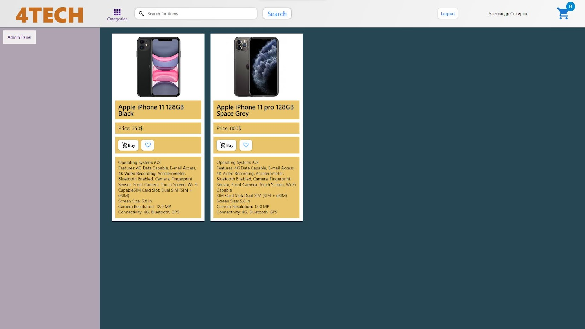
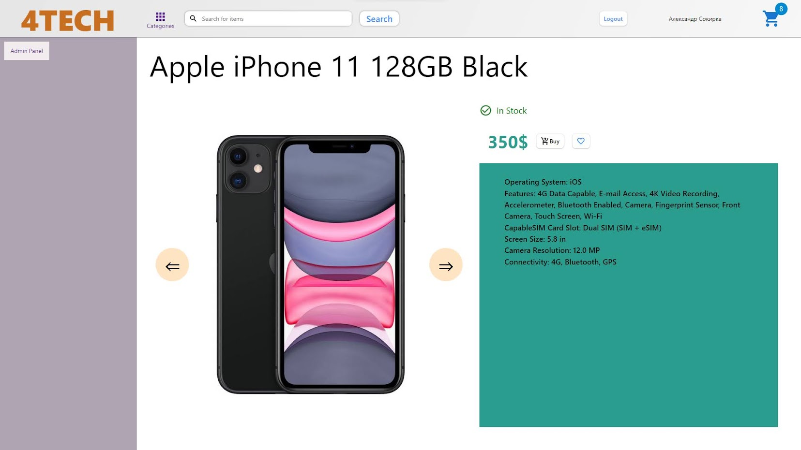
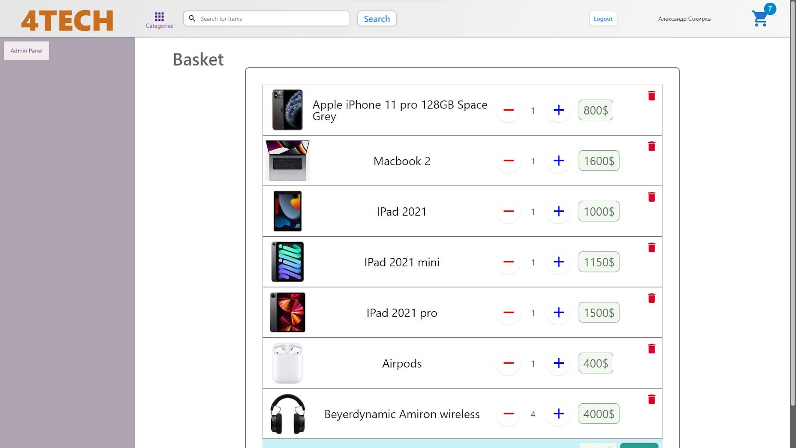

# 4TECH devices shop

Project of Single Page App online shop with google Firebase.


## Features

- Login with google account
- Live preview of selected item
- Addig items to shopping cart and chosing amount
- Auto complete shopping cart after reloading app
- Creating and sending order to server
- Admin can add new items into store


## Tech Stack

**Client:** React, React Router Dom 6, React Hook Form, Redux-Toolkit, Redux-Thunk, Redux-Persist, MUI, Lodash

**Server:** Goggle Firebase


## Appendix


I paid more attention to the logical part and functionality, and not to the design, so the appearance is not so good.
## Screenshots

    
    


## Run Locally

Clone the project

```bash
  git clone https://github.com/LordMalacath/4Tech-market
```

Go to the project directory

```bash
  cd 4Tech-market
```

Install dependencies

```bash
  npm install
```

Start the server

```bash
  npm run start
```


## Environment Variables

To run this project, you will need to add the following environment variables to your .env file

`REACT_APP_FIREBASE_API_KEY`

`REACT_APP_FIREBASE_AUTH_DOMAIN`

`REACT_APP_FIREBASE_PROJECT_ID`

`REACT_APP_FIREBASE_STORAGE_BUCKET`

`REACT_APP_FIREBASE_MESSAGING_SENDER_ID`

`REACT_APP_FIREBASE_APP_ID`


## Authors

- [@LordMalacath](https://github.com/LordMalacath)


## License

[MIT](https://choosealicense.com/licenses/mit/)

